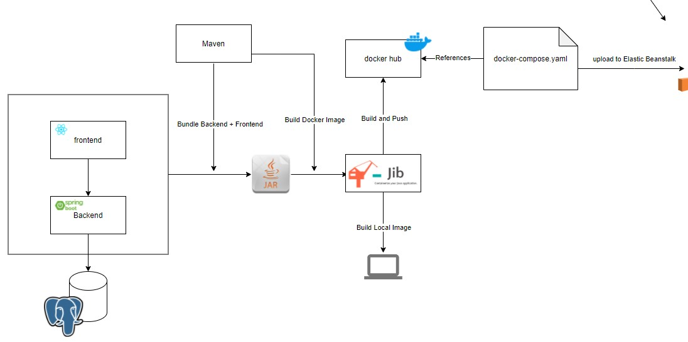
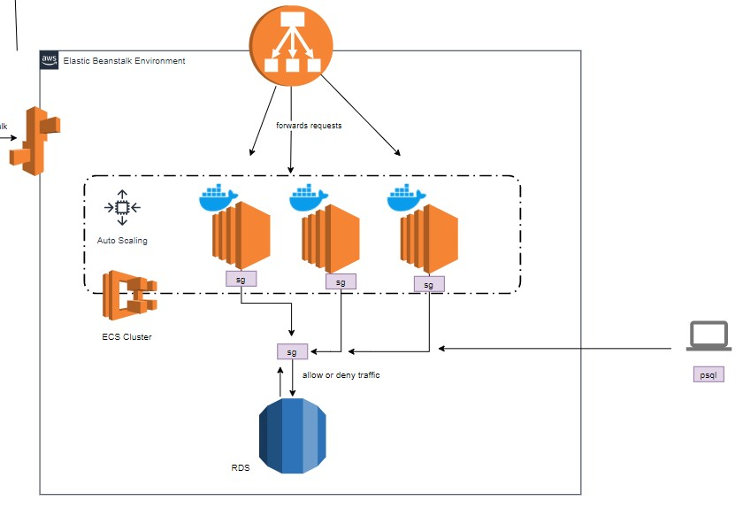

# User FullStack Application


All the project was made using:

* Hexagonal Architecture or Ports and Adapters
* Java 15
* Spring Boot, Spring Data JPA
* Maven version 3.6.3
* Postgres 13 Database Engine
* React.js Hooks and Functions Components
* Docker
* Jib for Packaging applications
* AWS RDS & Elastic Beanstalk
* CI-CD with Github Actions
* Mockito and JUnit5 for testing
* IntelliJ IDEA IDE & Visual Studio Code


## Prerequisites

* Install Java 15 or higher, download from this link [here](http://www.oracle.com/technetwork/java/javase/downloads/jdk8-downloads-2133151.html)
* Install Maven, download from this link [here](https://maven.apache.org/download.cgi). This article shows [how configure maven on Windows](https://www.mkyong.com/maven/how-to-install-maven-in-windows/).
* Install Docker, download from this link [here](https://www.docker.com/get-started).

## Setup

1) Clone the project from the repository.

```
git clone https://github.com/jsneider05/fullstack-spring-boot-react-aws.git
```

2) In the development IDE, create the configuration to run the SpringBoot project and create the environment variables:

```properties
AWS_RDS_URL=aws_rds_url
AWS_RDS_USERNAME=aws_rds_username
AWS_RDS_PASSWORD=aws_rds_password
```

## Run the project

1) Clean and install dependencies

```bash
cd fullstack-spring-boot-react-aws
mvn clean install -U
```

2) Run the project as a jar:

```bash
cd fullstack-spring-boot-react-aws/target
java -jar fullstack-${project.version}.jar
```
Or, as a Spring Boot Application with
```bash
mvn spring-boot:run
```
```bash
./mvnw spring-boot:run
```

## Swagger UI

|Proyecto|URL|
|--------|---|
|Debt|[http://localhost:8080/swagger-ui.html](http://localhost:8080/swagger-ui.html)|

### Diagram Architecture



### Deployment Process

